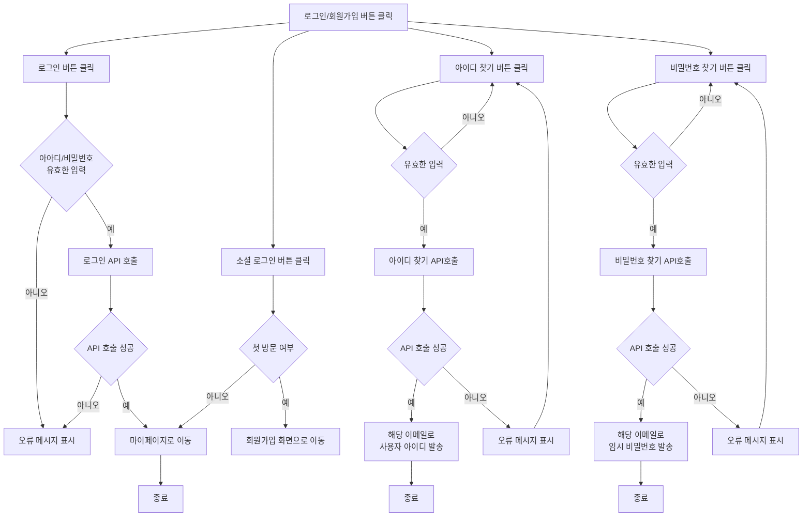
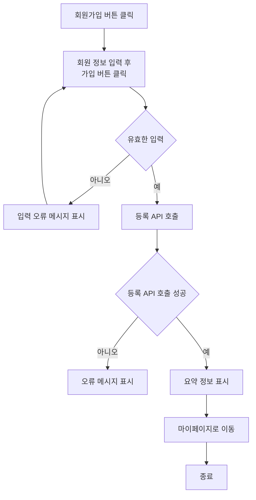
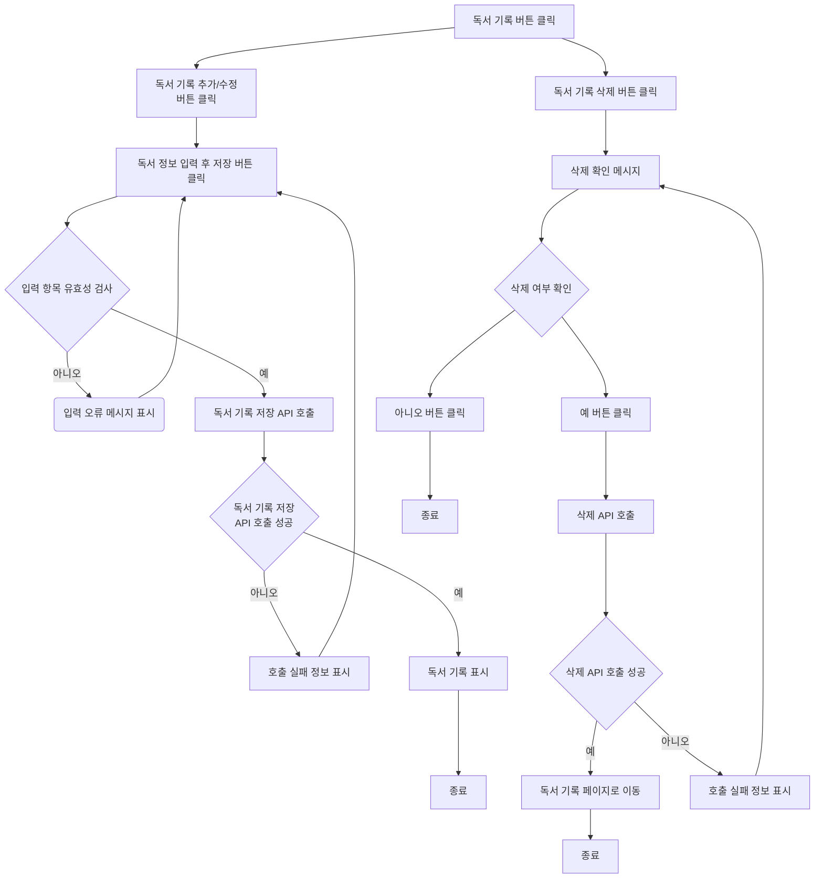
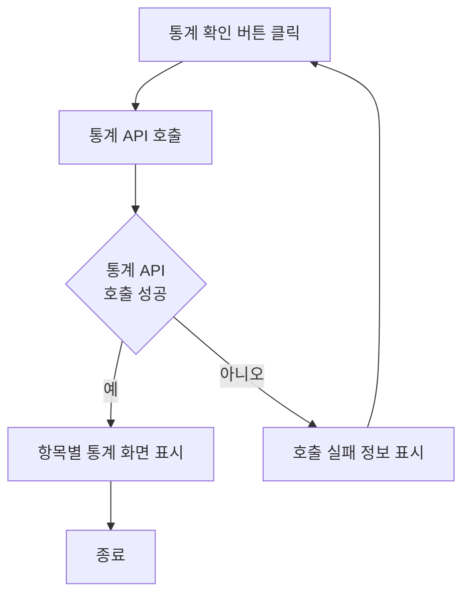
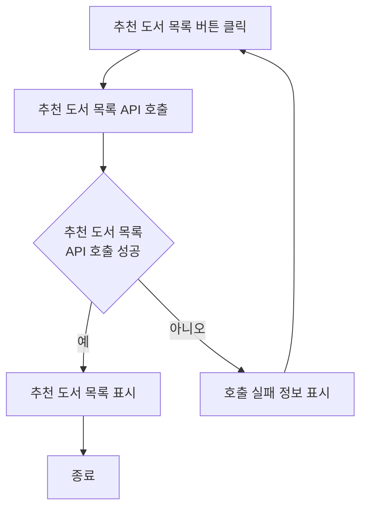
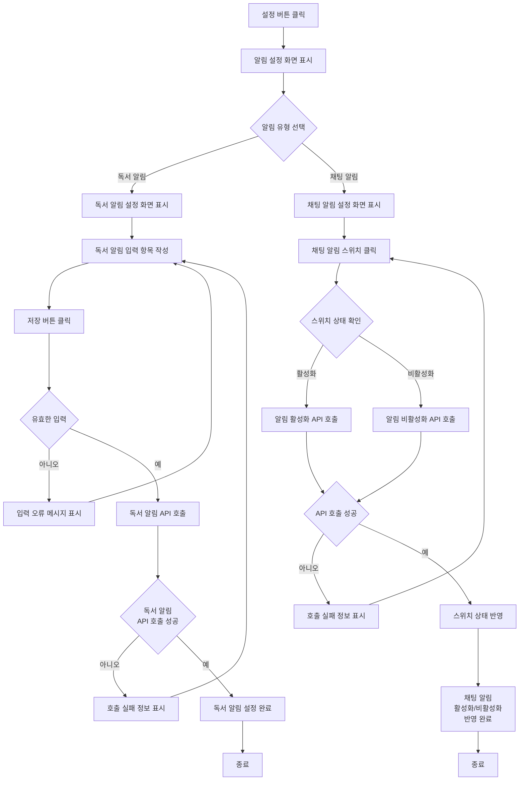
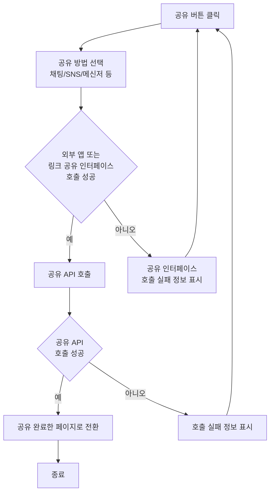
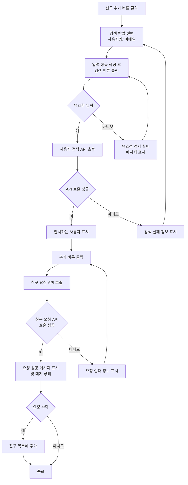
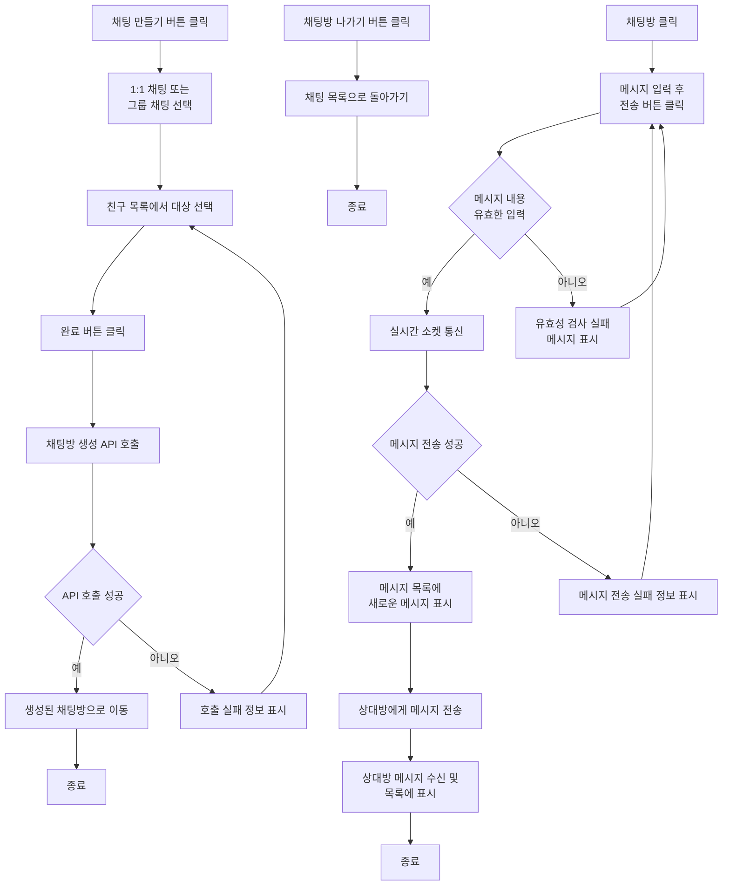

**기능 정의서:** 프로젝트 정의서의 사용자 스토리를 기반으로 세부 기능을 구체적으로 정의합니다.

### **페이지**

- 로그인
    - 로그인, 소셜로그인 버튼, 회원 가입, 아이디찾기, 비밀번호 찾기
- 회원가입
    - 이름,성별,생년월일,이메일,휴대폰 번호 입력 필드, 약관 동의 체크박스, 회원가입 버튼
- 마이페이지
    - 설정
        - 회원정보 수정 버튼
            - 닉네임, 이름, 자기소개, 연동할 SNS 계정(인스타그램, 트위터, 네이버블로그 등)
        - 알림 설정
            - 독서 알림 설정
        - 채팅 알람
            - 채팅 알람(끄기, 켜기(소리/진동/무음))
    - 내가 기록한 도서 목록
        - 도서 기록 추가 (제목, 저자, 장르, 태그, 읽기 시작한 날짜, 읽은 페이지 수(읽는 중/ 다 읽음 / 중단), 독서 시간, 감상평)
        - 도서 기록 수정 버튼
        - 도서 기록 삭제 버튼
        - 공유 버튼(채팅 / SNS / 메신저)
    - 독서 통계
        - 일별/주별/월별 독서 시간 - 캘린더 차트
        - 장르별 통계 - 원형 파이 차트
        - 독서 성취도(누적 독서 페이지/시간) - 선 그래프
        - 독서 내역 - 네트워크 그래프
    - 추천 도서 목록
        - 공유 버튼(채팅 / SNS / 메신저)
- 메인 페이지
    - 친구 추가 및 관리
        - 친구 추가(검색) 버튼
            - 이메일/사용자명으로 검색
            - 추가 버튼
        - 친구 목록
            - 친구 상태 확인(최근 읽은 책, 목표 달성률)
            - 친구 관리 버튼
                - 삭제/차단
    - 채팅
        - 채팅방 목록
        - 채팅 추가 버튼(1:1채팅, 그룹 채팅)
        - 채팅방 별 알림 설정 버튼
        - 공유 버튼(도서/ 독서기록)
- 아이디 찾기/비밀번호 찾기 - 회원관리
- 회원 정보 수정? - 회원관리

## 로그인 사용자 스토리

---

### 스마트 독서 앱 사용자로서, 나는 로그인을 이용하여 앱을 이용하고 싶습니다. 그래서 개인화된 독서 경험을 제공받고, 더 나은 독서 습관을 형성할 수 있습니다.

### **1. 기능명: 로그인**

- **기능 설명**: 사용자는 소셜 로그인 또는 이메일 로그인으로 스마트 독서 앱에 로그인할 수 있다.
- **입력 항목**:
    - 로그인
        - 아이디: 문자열, 최대 15자
        - 비밀번호: 문자열, 최대 10자
    - 아이디 찾기
        - 이름: 문자열, 최대 30자
        - 이메일: 문자열, 최대 50자 (유효성 검사 필요)
    - 비밀번호 찾기
        - 아이디: 문자열, 최대 30자
        - 이메일: 문자열, 최대 50자 (유효성 검사 필요)

### 1.1 사용자 액션

- **로그인 버튼 클릭**
    - 아이디와 비밀번호를 입력한 후 로그인 버튼을 클릭
    - 유효성 검사 후 로그인 절차 진행
    - 유효성 검사 실패 시 오류 메시지를 표시
    - 유효성 검사 통과 시 로그인 API 호출
    - API 호출 성공 시 메인 페이지로 리다이렉트
- **소셜 로그인 버튼 클릭**
    - 소셜 로그인 클릭 시 첫 방문인 경우 회원가입 페이지로 이동
    - 이미 가입된 사용자일 경우 바로 메인 페이지로 이동
- 아이디 찾기 버튼 클릭
    - 가입 시 등록한 이메일 입력
    - 아이디 전송 버튼 클릭 시, 해당 이메일로 사용자 아이디 발송
- 비밀번호 찾기 버튼 클릭
    - 아이디와 가입 시 등록한 이메일 입력
    - 비밀번호 찾기 버튼 클릭 시, 해당 이메일로 임시 비밀번호 발송

---

## 회원가입 사용자 스토리

### 스마트 독서 앱 미가입자로서, 나는 회원가입을 이용하여 앱에 가입하고 싶습니다.

### 2. 기능명: 회원가입

- **기능 설명**: 사용자는 소셜 로그인 또는 이메일 가입을 통해 쉽게 스마트 독서 앱에 가입할 수 있다.
- **입력 항목**:
    - 닉네임: 문자열, 최대 30자
    - 이름: 문자열, 최대 30자
    - 연락처: 문자열, 최대 15자 (유효성 검사 필요)
    - 이메일: 문자열, 최대 50자 (유효성 검사 필요)
    - 약관 동의: 체크박스
    - 아이디: 문자열, 최대 15자 (유효성 검사 필요)
    - 비밀번호: 문자열, 최대 10자 (유효성 검사 필요)

### 2.1 사용자 액션

- **회원가입 버튼 클릭**
    - 입력 항목을 모두 작성하고 회원가입 버튼을 클릭
    - 유효성 검사를 진행하며, 오류가 발생하면 해당 오류 메시지 표시
    - 유효성 검사 통과 시 API 호출하여 사용자 등록
    - API 호출 성공 시 요약 정보 표시 후 로그인 페이지로 리다이렉트

---

## 독서 기록 사용자 스토리

### 스마트 독서 앱 사용자로서, 나는 읽은 도서에 대한 정보를 기록하고 싶습니다. 그래서 내 독서 진행 상황을 추적하고, 더 나은 독서 계획을 세울 수 있습니다.

### 3. 기능명: 독서 기록 추가

- **기능 설명**: 사용자는 자신이 읽은 도서에 대한 기록을 추가하고, 각 도서의 정보와 독서 시간 및 감상평을 기록할 수 있다.
- **입력 항목**:
    - 책 제목: 문자열, 최대 50자
    - 저자명: 문자열, 최대 50자 (선택 사항)
    - 독서 시작일: 날짜 (선택 사항)
    - 독서 완료일: 날짜 (선택 사항)
    - 독서 시간: 분 단위 (선택 사항)
    - 감상평: 문자열, 최대 5000자 (선택 사항)
    - 찜: 체크박스 (선택 사항)

### 3.1 사용자 액션

- **독서 기록 버튼 클릭**
- **독서 기록 추가/수정 버튼 클릭**
    - 입력 항목 유효성 검사 실행
    - 유효성 검사 오류 발생 시 기록 절차는 종료되며 사용자에게 오류 정보 알림
    - 유효성 검사 통과 시 등록 API 호출
    - API 호출 성공 후 **독서 기록** 표시
- **독서 기록 삭제 버튼 클릭**
    - 삭제 확인 메시지 표시
    - 확인 버튼 클릭
        - 삭제 API 호출
        - API 호출 성공 후 **독서 기록 페이지**로 전환
    - 취소 버튼 클릭
        - 독서 기록 페이지로 전환

---

## 독서 통계 사용자 스토리

### 스마트 독서 앱 사용자로서, 나는 읽은 도서에 대한 통계를 확인하고 싶습니다.  그래서 내 독서 성과를 시각적으로 파악하고, 향후 목표를 설정할 수 있습니다

### 4. 기능명: 독서 통계 확인

- **기능 설명**: 사용자는 자신이 기록한 독서 데이터를 바탕으로 독서 시간 통계, 장르별 통계, 성취도 그래프, 네트워크 그래프를 확인할 수 있다.

### 4.1 사용자 액션

- **통계 확인 버튼 클릭**
    - 각 항목별 통계 그래프 표시
        - 캘린터 차트(일별/주별/월별 독서 시간)
        - 파이 차트 그래프(입력된 책의 장르 비율)
        - 선 그래프(누적 독서 페이지/시간)
        - 네트워크 그래프(입력된 책의 종합 데이터)

---

## 추천 도서 사용자 스토리

### 스마트 독서 앱 사용자로서, 나는 읽은 도서를 기반으로 책을 추천받고 싶습니다. 그래서 나의 취향에 맞는 책을 쉽게 발견하고, 더 다양한 독서 경험을 할 수 있습니다.

### 5. 기능명: 추천 도서

- **기능 설명**: 사용자는 자신이 좋아하는 장르나 관심사를 기반으로 맞춤형 추천 도서를 받을 수 있다.

### 5.1 사용자 액션

- **추천 도서 목록**
- **추천 도서 클릭**
    - 추천 책의 연관성을 네트워크 그래프로 표시

## 알림 사용자 스토리

---

### 스마트 독서 앱 사용자로서, 나는 독서 목표에 대한 알림을 설정하고 싶습니다. 그래서 목표 달성을 위한 일정 관리를 효율적으로 할 수 있습니다.

### 6.기능: 알림

- 기능 설명
    - 사용자는 독서 목표에 따른 알림을 설정할 수 있습니다.
    - 사용자는 채팅에 대한 알림을 설정할 수 있습니다.

- 입력 항목
    - 독서 알림
        - 요일: 체크박스(선택 사항)
        - 시간: 드롭다운 입력 (HH:mm 형식)
        - 반복 설정: 스위치
    - 채팅 알림
        - 활성화/비활성화: 스위치

### 6.1 사용자 액션

- 설정 버튼 클릭
- 독서 알림 설정
    - 독서 알림 버튼 클릭
    - 입력 항목 작성 후 저장 버튼 클릭
    - 알림 API 호출
    - API 호출 성공 후 해당 시각에 알림
- 채팅 알림 설정
    - 채팅 알림 스위치 클릭
    - 상태에 따른 API 호출
    - API 호출 성공 후 상태에 따른 알림 제공/미제공

## 공유 사용자 스토리

---

### 스마트 독서 앱 사용자로서, 나는 다른 사용자에게 도서/기록을 공유하고 싶습니다. 그래서 독서 경험을 나누고, 서로의 책 추천을 받을 수 있습니다.

### 7.기능: 공유

- 기능 설명
    - 사용자는 도서 또는 독서기록을 채팅/SNS/메신저를 통해 공유할 수 있습니다.
- 입력 항목
    - 도서/독서기록: 라디오 버튼
    - 공유 대상: 체크박스

### 7.1 사용자 액션

- 도서/독서기록 클릭
- 공유 버튼 클릭
- 공유 방법 선택: 채팅/SNS/메신저 등
- 선택된 공유 방법에 따라 외부 앱 또는 링크 공유 인터페이스 호출
- 공유 API 호출
- API 호출 성공 후 공유 완료한 페이지로 전환

## 친구 추가 사용자 스토리

---

### 스마트 독서 앱 사용자로서, 나는 친구를 추가하고 싶습니다. 그래서 친구와 독서 경험을 공유하고, 함께 책을 추천하거나 읽을 수 있습니다.

### 8.기능: 친구 추가

- 기능 설명
    - 사용자는 텍스트 메시지를 주고받으며 실시간으로 대화할 수 있습니다. 메시지가 즉시 상대방에게 전달되고, 빠른 응답이 가능합니다.
- 입력 항목(택1)
    - 이메일: 문자열, 최대 50자 (유효성 검사 필요)
    - 이름: 문자열, 최대 30자(유효성 검사 필요)

### 8.1 사용자 액션

- 친구 추가 버튼 클릭
- 검색 방법 선택: 사용자명, 이메일
- 입력 항목 작성 후 검색 버튼 클릭
- 유효성 검사를 진행하며, 오류가 발생하면 해당 오류 메시지 표시
- 요효성 검사 완료 후 사용자 검색 API 호출
- API 호출 성공 후 일치하는 사용자를 표시
- 추가 버튼 클릭
- 친구 요청 API 호출
- API 호출 성공 시 요청이 성공적으로 전송되었음을 사용자에게 알림.
- 요청이 수락되었을 경우, 친구 목록에 해당 사용자 추가

## 채팅 사용자 스토리

---

### 스마트 독서 앱 사용자로서, 나는 다른 사용자와 실시간 대화를 할 수 있는 채팅방을 관리하고 싶습니다. 그래서 도서에 대한 의견을 나누고, 서로의 책에 대해 즉시 소통할 수 있습니다.

### 9.기능: 채팅

- 기능 설명
    - 사용자는 1:1 채팅 또는 그룹 채팅을 생성&관리할 수 있습니다.
    - 사용자는 텍스트 메시지를 주고받으며 실시간으로 대화할 수 있습니다. 메시지가 즉시 상대방에게 전달되고, 빠른 응답이 가능합니다.
- 입력 항목
    - 채팅방 생성
        - 채팅 대상: 체크박스
    - 채팅
        - 메시지: 문자열,  최대 76자

### 9.1 사용자 액션

- 채팅방 생성
    - 채팅 만들기 버튼 클릭
    - 채팅 대상 선택 후 만들기 버튼 클릭
    - 채팅방 생성 후 해당 페이지로 전환
- 채팅
    - 채팅방 클릭
    - 메시지 입력 후 연결 유지 시 실시간 소켓 통신
    - 메시지 성공 시 메시지 목록 표시

