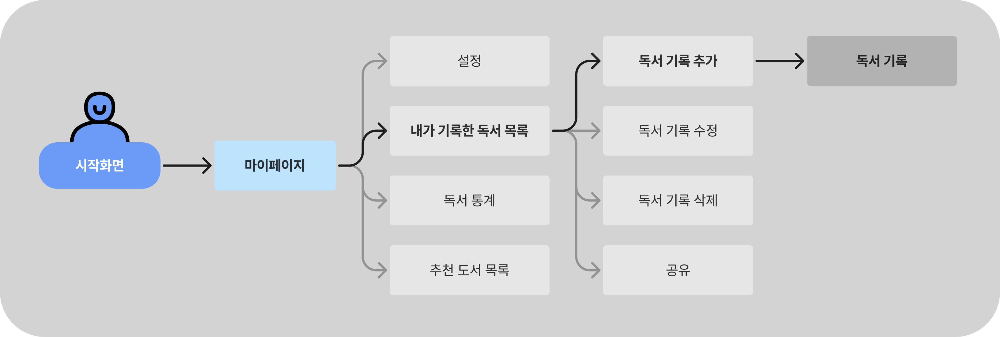
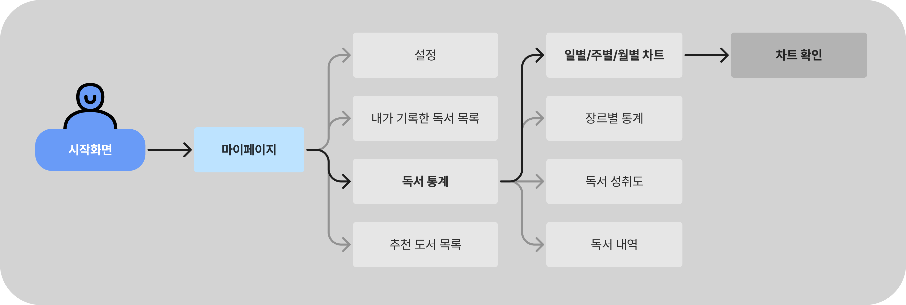

## 개요

### 프로젝트 명

스마트 독서 기록 웹앱

### 목표

- 독서 기록의 체계적인 관리
- 독서 습관 분석
- 그래프를 이용한 독서 통계 시각화
- 개인 및 그룹 채팅

### 사용자 정의

- 독서를 즐기는 일반 사용자
- 체계적인 독서 습관을 만들고 싶은 사용자
- 책 추천 및 구매를 원하는 독서 애호가
- 친구나 그룹을 통해 독서를 공유하고 싶은 사용자

## 요구사항

[**요구사항 정의서**](https://www.notion.so/1653259dc0c281c2a5e5edf3b23e2f62?pvs=21) 참고

## 시스템 아키텍처

### 아키텍처 개요

- **프론트엔드** : TypeScript(React.js, Chart.js)
- **백엔드** : Firebase (Firestore, Authentication)
- **데이터베이스** : Mongo DB, PostgreSQL/MySQL

### 모듈 구성

- 프론트엔드 : 사용자 인터페이스, 데이터 시각화, API 연동
- 백엔드 : RESTful API, 비즈니스 로직, 데이터 베이스 연동
- 데이터베이스 : 사용자 정보, 책 정보, 독서 기록 정보, 책 추천 정보, 채팅 정보

### 데이터베이스 설계

- **사용자 테이블** : 사용자 정보(ID, 이름, 이메일, 비밀번호, 선호 장르 등)
- **책 테이블** : 책 정보(ID, 제목, 저자, 장르, 출판일 등)
- **독서 기록 테이블** : 사용자별 독서 기록(책 ID, 날짜, 페이지 수, 독서 시간, 감상평 등)
- **추천 기록 테이블** :사용자별 추천 기록(책 ID, 추천 이유 등)

### 인터페이스 설계

- 프론트엔드-백엔드 인터페이스 : RESTful API를 사용한 데이터 통신
- 벡엔드-데이터베이스 인터페이스 : Prisma ORM를 사용한 MySQL 연동

## 설계 상세

### 사용자 스토리

- **독서 기록 및 통계**
    
    독서 시간을 기록하고, 매달 읽은 페이지 수와 시간을 시각화된 차트로 확인하고 싶습니다.
    
    
    
- **감상평 남기기**
    
    읽은 도서에 대한 감상평을 남기고 싶습니다.
    
- **맞춤형 도서 추천**
    
    읽은 도서의 정보를 기반으로 맟춤형 도서를 추천받고 싶습니다.
    
- **독서 기록 공유 & 추천 도서 공유**
    
    독서 기록이나 추천 도서를 다른 사용자에게 공유하고 싶습니다.
    
- **채팅**
    
    친구와 독서 기록을 공유하고 읽은 도서에 대한 대화를 채팅방에서 나누고 싶습니다. 
    

## 구현 계획`

### 개발 환경

- **프론트엔드** : HTML, CSS, TypeScript, React.js
- **라이브러리**: Chart.js
- **백엔드** : Firebase (Firestore, Authentication)
- **데이터베이스** : Mongo DB, MySQL
- **도구** : Visual Studio Code, Git, Figma

### 개발 일정

1. 아이디어 기획 및 요구사항 정의: 1주
2. UI/UX 디자인: 2주
3. 백엔드 설계 및 개발: 4주
4. 프론트엔드 개발: 4주
5. 통합 및 테스트: 2주
6. 배포 및 유지보수(지속적)

### 자원 계획

- PM: 1명
- UI/UX 디자이너: 1명
- 프론트엔드 개발자: 2명
- 백엔드 개발자: 2명
- 예산: 서버 비용, API 사용료, 도구 라이선스 비용

### 테스트 계획

- **테스트 전략**
    
    유닛 테스트, 통합 테스트, 사용자 피드백 기반 QA 테스트
    
- **테스트 시나리오**
    
    기능별 TC(테스트 케이스) 정의서 참고
    
- **품질 보증**
    
    코드 리뷰, 자동화 테스트(E2E), 성능 테스트
    

### 배포 계획

- **배포 전략**
    
    Firebase hosting을 활용한 배포, 도메인 이름 설정 및 SSL 인증서 적용
    
- **유지보수 계획**
    
    버그 수정 및 기능 개선을 위한 정기 업데이트
    

### 문서화

- **사용자 매뉴얼**
    
    시스템 사용법을 설명하는 매뉴얼 작성
    
- **개발자 문서**
    
    시스템 아키텍처, API 명세서, 코드 설명서 작성, 프로젝트 진행 단계별 문서화
    
- **용어 정의**
    
    주요 용어와 약어 정의